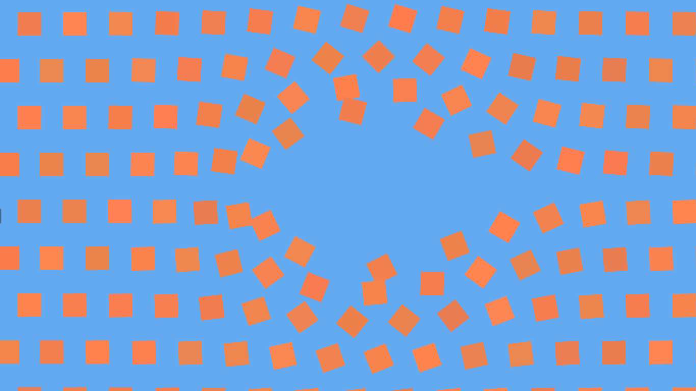

# js-visual
A collection of small Javascript (audio)visual pieces that I have created over the years. I do not consider these to be big enough to deserve their own repository.

## [Clockwise](https://iamwave.github.io/js-visual/clockwise/) (Aug 2014)
Fractal-ish circles spinning clockwise.

## [Beige](https://iamwave.github.io/js-visual/beige/) (Aug 2014)
A tiny, calming, interactive piece based on a recurring dream of mine. Try dragging or holding the mouse.

## [Depth](https://iamwave.github.io/js-visual/depth/) (Oct 2014)
A simple [Sierpinski triangle](https://en.wikipedia.org/wiki/Sierpinski_triangle) zoom. It spins, too!

## [Pendulum](https://iamwave.github.io/js-visual/pendulum/) (Oct 2014)
Simulates the famous pendulum wave effect.

## [Grow](https://iamwave.github.io/js-visual/grow/) (Oct 2014)
Watch a randomly generated tree grow in real-time.

## [195](https://iamwave.github.io/js-visual/195/) (Jan 2015)
Fractal mapping based on [xkcd 195](http://xkcd.com/195/).

## [Wolfram](https://iamwave.github.io/js-visual/wolfram/) (Feb 2016)
Wolfram's cellular automata on a torus, with pretty colors. [Further instructions in the source.](wolfram/wolfram.js)

## [Web](https://iamwave.github.io/js-visual/web/) (Dec 2016)
A minimalist web-like tessalation.

## [The Wall](https://iamwave.github.io/js-visual/wall) (Feb 2017)

